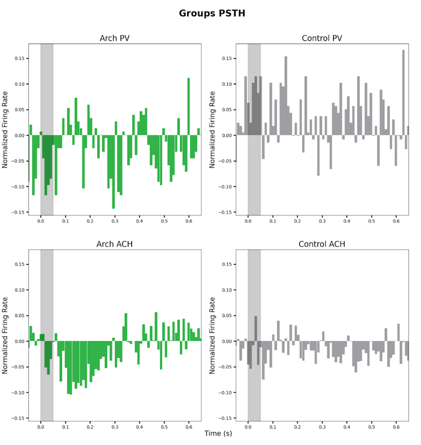

This is a nascent application for analyzing electrophysiology experiments in Python, developed on animal conditioning 
paradigms.  It takes as input Phy-curated spike data, raw local field potential data, and/or behavioral data and outputs 
plots and/or csv files for further data analysis. 

As a first step, activate the virtual environment by navigating to the `spike_data_processing` directory in your shell 
and executing the command `source venv/bin/activate` (on Unix-like systems).

The file that you execute to make one of those things happen is [main.py](main.py). The `main` function initializes a 
`Runner`, which must receive three things: the name of the procedure you're going to run, the configuration of your 
experiment, and the configuration of the procedure you're going to run.  The two configurations can be paths to JSON 
files or Python dictionaries.  

Here is an example `main` function that plots a peri-stimulus time histogram:
```
def main():
    runner = Runner(config_file='<path_to_config>/init_config.json')
    runner.run('plot_psth', PSTH_OPTS)
```
It assumes that the experiment is configured in a JSON file accessible at the given path, and that the analysis 
configuration is a Python dictionary defined in the same module or imported from another. 
You can find [instructions](misc_data_init/experiment_config_howto.md) for experiment 
configuration and examples in the [misc_data_init](misc_data_init) directory, as well as 
[instructions](misc_data_init/analysis_config_howto.md) for and examples of analysis configuration.

If you want to run local field potential or behavioral analyses in addition to or instead of spike analyses you must 
pass the Runner arguments to tell it to initialize that data, like so:

```
def main():
    runner = Runner(config_file='<path_to_config>/init_config.json', lfp=True)
    runner.run('plot_mrl', MRL_OPTS)
```
(and mutatis mutandi for behavior).

The `run` method can also take variable arguments that are passed to the `make_spreadsheet` procedure.  For example:

```
def main():
    runner = Runner(config_file='<path_to_config>/init_config.json', lfp=True)
    runner.run('make_spreadsheet', LIST_OF_OPTS_DICTS, path='</path/where/csv/is/written>')
```

### Procedures you can run

### Plots

The plotting functions that have the form plot_<data_type> can generate plots at multiple levels of the data hierarchy -- 
Group, Animal, and Unit (or UnitPair for cross-correlation/cross-correlogram). The higher levels are averaged over the 
lower ones. Starting with "plot_group_stats" in the following list, plots are currently enabled only at the group level.

- plot_psth: plots the peri-stimulus time histogram of firing rates

- plot_autocorrelation: plots the autocorrelation of a firing rate series
- plot_autocorrelogram*: plots the Phy-style histogram of firing in the vicinity of other spikes
- plot_spectrum: plot a frequency-domain spectrum of the time series from any other data type in the experiment
- plot_cross_correlation: plot pairwise cross correlation of different units (from the same animal), either individually 
or averaged over types of unit pairs
- plot_cross_correlogram*: plot the analogous Phy-style cross-correlogram
- plot_group_stats: a graph with the data series for groups overlaid on each other as line plots, and significance 
markers to show in which time bins post hoc significance tests differ significantly from each other.
- mrl_rose_plot: a polar histogram of angles of the LFP signal in a given frequency range at the moment at which a unit 
fired (not strictly MRL, that is Mean Resultant Length, but rather a different way of visualizing the underlying phase 
data -- as counts)
- mrl_heat_map: a heat map on a grid of dimensions period x frequency, displaying frequency values at finer granularity.
- mrl_bar_plot: a bar plot of MRL values, by group, period type, and neuron type
- unit_upregulation_pie_chart: generates pie charts, one per group, showing the percentage of units whose data were 
up or down regulated, or showed no change.
- neuron_type_scatterplot: make a scatterplot of firing rate versus full-width half minimum for every unit in the 
experiment, color-coded by neuron type.
- plot_waveforms: make a superimposed graph of mean extracted waveforms from individual neurons, color-coded by neuron 
type 
- plot_power: make a line plot of the power spectrum averaged over a given frequency range and the period

There is also a [figures](/figures) directory that contains code for a custom figure (which also contains a 
demonstration of plots extracted from Phy).

### Spreadsheet

- make_spreadsheet: outputs a CSV file with any combination of calculations from data from the same experiment. When 
multiple kinds of calculations are done, they are merged into a single spreadsheet by the values they have in common.

In addition to the data types discussed in the context of plots, your spreadsheet can also include power, which is 
extracted from the LFP raw data via the multitaper time-frequency cross spectrogram program, implemented in Matlab, and 
behavior, which is at this writing still specific to a specific format of percent freezing data and has not yet been
abstracted.

* note that I've adopted Phy's usage of "correlogram" and it's not typical of the wider world.

### Requirements

In addition to the Python packages specified in venv/lib, some functionality depends on other applications installed on 
your computer.  Calculations of power and coherence from raw LFP data depend on having a working version of Matlab 
installed, along with two scripts from Professor Kenneth Harris's lab (`mtcsg.m` and `mtchg.m`) and their dependencies.
These scripts are not distributed with this repo; if you need them, please email the author in the very remote chance 
you are someone reading this who is not in the Likhtik lab, or if you are, Whatsapp her.

The `plot_group_stats` function depends on having a working R installation, along with the following R packages: `lme4`,  
`glmmTMB`, `lmerTest`, and `readr`.  

This functionality was tested with Matlab 2022a and R version 4.2.1, readr_2.1.4, lmerTest_3.1-3, lme4_1.1-30, and 
glmmTMB_1.1.7. 


### Notes for developers and troubleshooters

The basic data representations can be found in three files, [spike.py](spike.py), which contains a hierarchical 
representation spike data with classes such as Animal, Unit, Period, and Event, [lfp.py](lfp.py), which contains a 
hierarchical representation of lfp data, with classes such as LFPAnimal, LFPPeriod, and MRLCalculator, and 
[behavior.py](behavior.py), which contains a hierarchical representation of behavioral data, with classes such as 
BehaviorPeriod.  Maybe someday this will change, but right now it's obligatory to define animals with the classes in 
spike.py before doing any other analysis, however it's not actually obligatory to define any spike data. Objects in 
these modules have parents and children.  For example, in the spike module, a Period's parent is a Unit, and its 
children are Events.  Values for plots are calculated on objects, averaging over their children; values for csv files

The Context class is defined in [context.py](context.py).  It keeps track of state variables like `data_opts`, 
`neuron_type` and `period_type` and notifies subscribers when they change. Each of the three types of data, spike, lfp, 
and behavior, has a top level experiment class, which subscribes to notifications of context changes and updates its 
descendants when necessary.  For example, when the current `neuron_type` changes to 'IN', the spike experiment will be 
notified and call a function on all the animals in the experiment to change the constituents of their `children` 
property to be just IN's.  This tends to me more important for making graphs and figures, which aggregate data by 
category, as opposed to csv files. `data_opts` also contains state variables that require updating; units update their 
constituent periods depending on which events are indicated for inclusion by `data_opts`.

Another module which builds on the content of `data_opts` is [data.py](data.py).  Most classes in the app inherit from 
`Base`, and nearly every class that is a data representation (e.g. `Period`, `LFPAnimal`) inherits from Data. (`TimeBin` 
is the sole exception).  `Base` contains property methods for accessing aspects of the data_opts or for setting/getting
aspects of the context.  For example, the `data_type` key in the `data_opts` dict is what informs the program what set 
of operations it's about to do. When `data_type` is set to 'power', for instance, the `data` property on any object will
return that objects `get_power` method (or raise an error if it does not exist).  The same for 'psth', 'mrl', etc. 
`Data` contains methods for establishing hierarchical relationships among data representations 
and for doing standard calculations (like calculating data means and standard deviations over an object's children.)

The modules containing the classes which coordinate the work to be done on the model are [plotters.py](plotters.py) and 
[stats.py](stats.py).  There are currently several types of platters in the `plotters` module (all of which inherit from
the top-level plotter class); so far `Stats` is just one class that handles both making csv files and interfacing with 
R for the purpose of running post-hoc tests.


